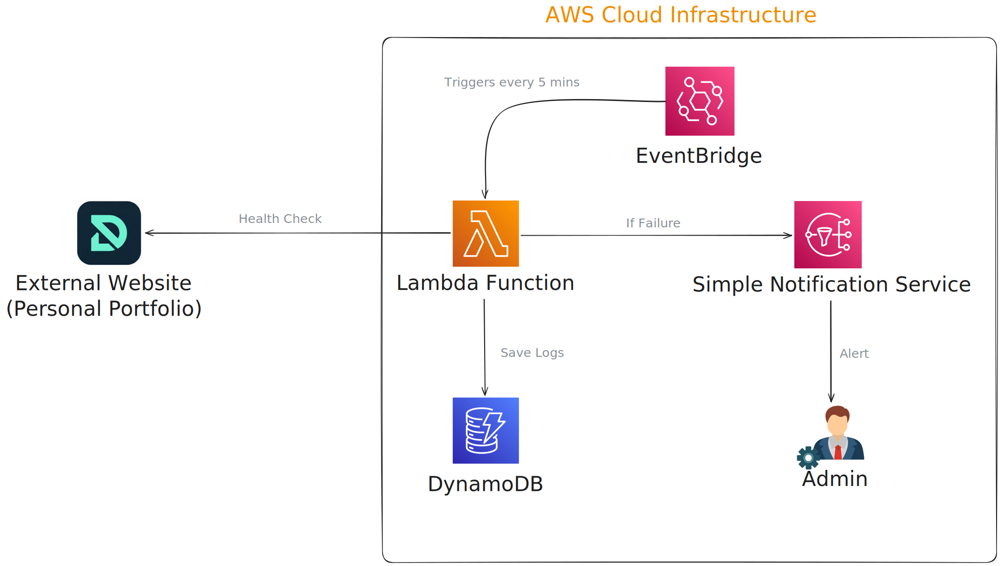
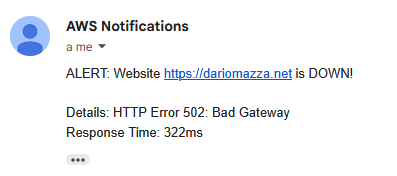
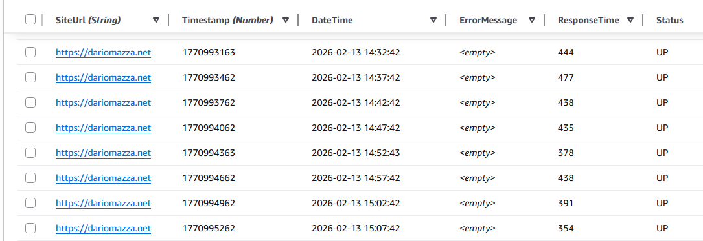

# AWS Website Uptime Monitor

## Project Overview
This project is a high-reliability monitoring solution designed to ensure website availability, performance, and content integrity. Built with a **"Reliability-First"** mindset, it addresses the critical business need for immediate downtime detection, preventing lost revenue and reputation damage by alerting stakeholders before customers notice any issues.

> **Why this matters:** Simple "ping" monitors often miss "silent failures" where a server is up but the application is showing a blank page or a 500 error. This system provides deep visibility into the actual user experience.

## Architecture
The system follows a 100% Serverless architecture for maximum scalability and zero maintenance costs.

*   **Trigger:** Amazon EventBridge (runs every 5 minutes).
*   **Compute:** AWS Lambda (Python 3.11) executing multi-layer health checks.
*   **Storage:** Amazon DynamoDB (NoSQL) for high-performance time-series logging.
*   **Alerting:** Amazon SNS (Instant Email/SMS notifications).

## Tech Stack
*   **Languages:** Python 3.11 (Logic).
*   **Infrastructure as Code:** Terraform.
*   **AWS Services:** Lambda, DynamoDB, SNS, EventBridge, IAM.
*   **Tooling:** `mise` (runtime management), `boto3` (AWS SDK).

## Technical Implementation
Detailed health checks go beyond connectivity to verify:
*   **Availability:** Standard HTTP status code verification.
*   **Performance (SLAs):** Measuring total response time in milliseconds. Alerts are triggered if latency exceeds defined thresholds (e.g., > 5s).
*   **Content Integrity:** HTML parsing to find specific keywords, ensuring the site isn't showing a "White Screen of Death" or partial content.
*   **Intelligent Maintenance Window (Homelab Stratagem):** Since the target portfolio is hosted on a private **k3s cluster** located in my bedroom, the cluster is powered down at night (00:00 - 08:00) to eliminate fan noise. The monitor uses intelligent logic to suppress SNS alerts and flag DynamoDB logs as `MAINTENANCE_DOWN` during these hours, preventing false alarms while the homelab rests.

### System Alerts
When a failure is detected, an instant notification is sent via Amazon SNS:

## Production Verification
The system is designed for production-grade reliability:
*   **CloudWatch Logs:** Lambda execution is monitored for errors and execution time.
*   **NoSQL Time-Series:** Data is stored in DynamoDB with a `Timestamp` sort key, allowing for efficient historical querying and trend analysis.
    
*   **Simulated Failure Testing:** System resilience is verified by temporarily injecting "Content Errors" (looking for non-existent keywords) to trigger the end-to-end alerting pipeline.

## Business Impact
*   **Proactive Mitigation:** Detects and reports issues within 5 minutes, significantly reducing Mean Time to Repair (MTTR).
*   **Cost Efficiency:** $0/month idle cost due to the Serverless model—only pay for the seconds the monitor actually runs.
*   **Customer Trust:** Ensures that "silent" application failures are caught immediately, maintaining a professional brand image.
*   **Data-Driven Insights:** Historical uptime and performance data allow for informed decisions regarding hosting providers or infrastructure upgrades.

---
*Developed to demonstrate mastery of AWS Serverless patterns, Infrastructure as Code, and Business-Focused Observability.*
